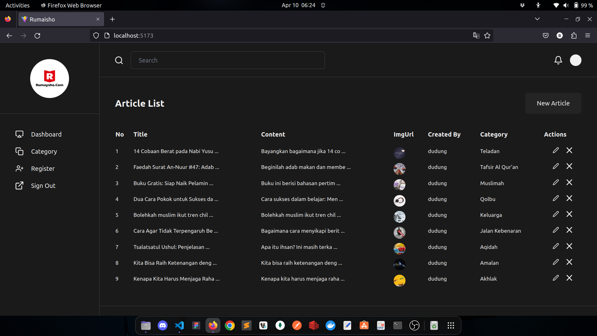
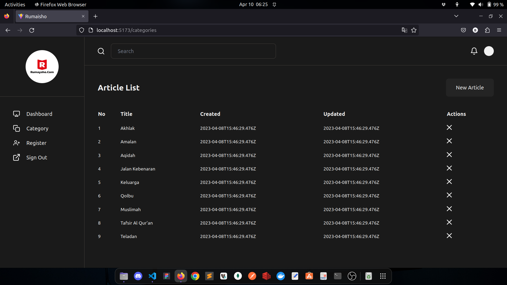
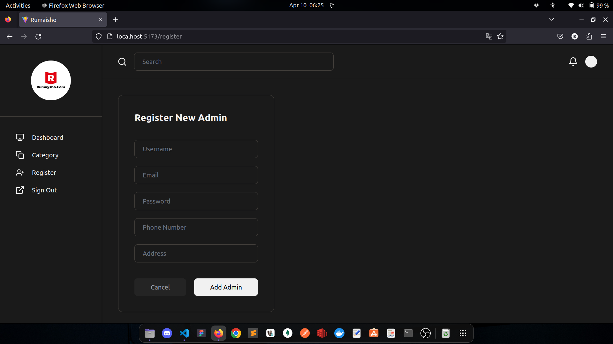
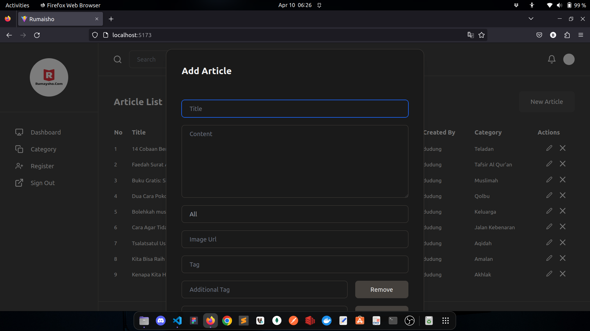
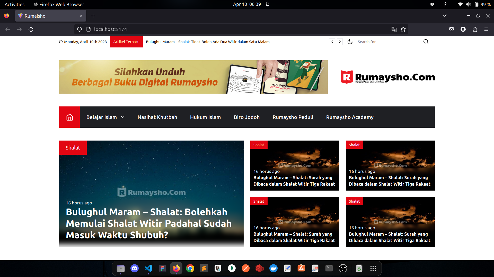
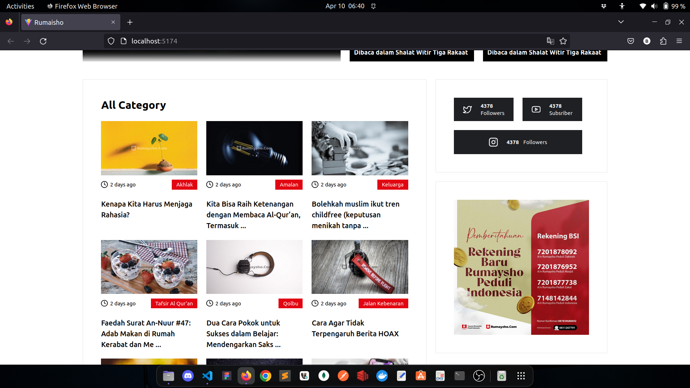
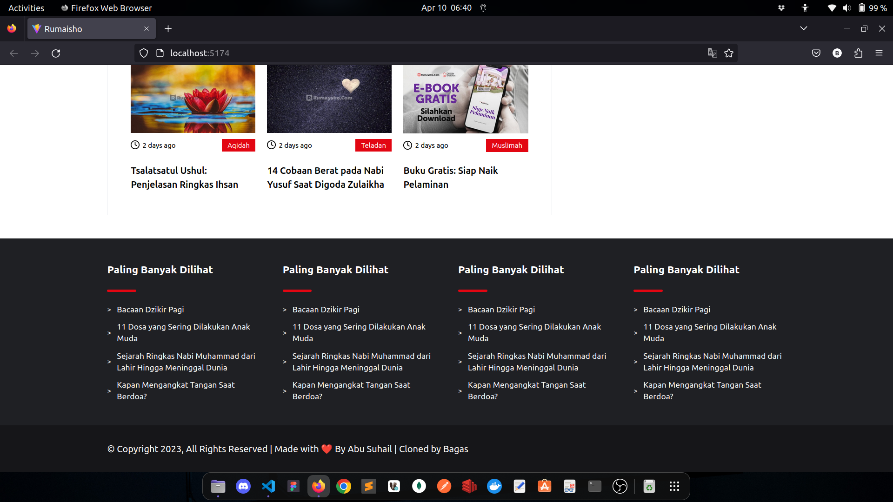
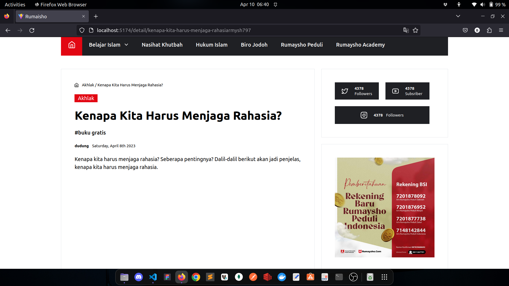

# P3-Challenge-1

- Tema Aplikasi: News Portal (Reference: https://rumasyho.com)
- CSS Framework: Tailwind CSS

## Result

Admin Side (CMS):

Client Side:

Struktur Folder:

- server (PORT: 3000)
- client-user
- client-admin

## W1D1

Target:

- [x] Lecture - React Intro
- [x] React: Class Component vs Function Component
- [x] Mempelajari State menggunakan useState
- [x] Mengirim Props baik berupa sebuah state atau function
- [x] Event Handling (onClick, onChange, onSubmit)
- [x] Conditional Rendering di dalam React
- [x] Looping List of Data di dalam React
- [x] Lifecycle component menggunakan useEffect
- [x] Membuat server (json-server)
- [x] Membuat react app untuk client-user (Styling)
- [x] Membuat react app untuk client-admin (CRUD)
- [x] Menentukan Thema Aplikasi
- [x] Menentukan Design dan pemilihan CSS Framework

**Report:**

Hari ini saya belajar React Component, saya memahami bagaiman cara import export Component pada React. Saya juga mencoba sedikit mengenai headless ui dan install React menggunakan vite. Namun, saya belum coba lebih jauh karena masih dalam proses layout dan slicing component
Pada tugas ini, saya memilih tema News Portal dengan mengambil referensi dari Rumasyho : https://rumasyho.com. Saya juga menggunakan CSS Framework yaitu Tailwind CSS

> contoh: Hari ini saya belajar React Component. Saya memahami bagaimana cara React bekerja. Lifecycle yang sudah saya coba adalah componentDidMount yang digunakan untuk fetch data dst. Namun saya belum mencoba menggunakan onSubmit dikarenakan data yang didapat belum sesuai.
> Pada tugas ini, saya memilih Tema A dengan mengambil referensi dari B. Saya juga akan menggunakan CSS Framework yaitu Tailwind CSS

## W1D2

Target:

- [x] Lecture - Custom Hooks
- [x] Rules of Hooks
- [x] Lecture - React-Router
- [x] Membuat router user-side (min: home, detail)
- [x] Membuat router admin-side (min: login, add admin, CRUD main entitas, CRUD another entitas)
- [x] Membuat privateRoute untuk admin

**Report:**

Hari ini saya belajar menggunakan state, mengirim sebuah props, conditional rendering dalam react, looping, dan lifecyle component menggunakan react. Dan juga saya belajar membuat custom hooks, berkenalan dengan rules of hooks dan mengimplementasikan react router

## W1D3

Target:

- [x] Lecture - Redux
- [x] State vs Global State
- [x] Bagaimana cara membuat Store
- [x] Bagaimana cara membuat Reducer
- [x] Bagaimana cara membuat Action
- [x] Membuat Action Creators
- [x] Membuat Action Types
- [x] Lecture - Redux-thunk (handle async)
- [x] Cara menggunakan combineReducers

**Report:**

...

## W1D4

Target:

- [x] Lecture - SQL Advance DQL
- [x] Membuat server mengguanakan express.js, postgreSQL dan Sequelize
- [x] Menentukan associations antar tables
- [x] Lecture - SQL Transaction
- [x] Membuat transaction saat membuat entitas baru pada main table. Pastikan ada assosiasi di dalamnya

**Report:**

...

## W1D5

Target:

- [x] LC Simulation
- [x] Practice, Practice, Practice

**Report:**

...
